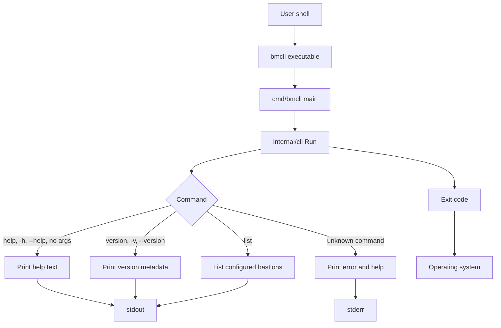

# bmcli

`bmcli` is the Bastion Management CLI. This repository currently contains a
small Go command with help, version, and bastion listing commands.

## Architecture

`bmcli` is organized as a small Go command line application. The executable
entrypoint in `cmd/bmcli` delegates command handling to the reusable CLI package
in `internal/cli`, which writes user-facing output to the provided streams and
returns an exit code to the operating system.



See [docs/architecture.md](docs/architecture.md) for more detail.

## Prerequisites

- Go 1.22 or newer

## Usage

```sh
go run ./cmd/bmcli --help
go run ./cmd/bmcli help
go run ./cmd/bmcli list
go run ./cmd/bmcli list --json
go run ./cmd/bmcli version
go run ./cmd/bmcli version --json
```

By default, `list` reads `~/.config/bmcli/config.json`. Use `--config` to point
at a specific config file:

```sh
go run ./cmd/bmcli --config ./config.json list
```

Expected config shape:

```json
{
  "bastions": [
    {
      "name": "dev-us-east",
      "environment": "dev",
      "region": "us-east-1",
      "hostname": "bastion.dev.example",
      "port": 22
    }
  ]
}
```

When no bastions are configured, `list` exits successfully and prints a setup
suggestion. In JSON mode the output remains valid JSON:

```json
{
  "bastions": [],
  "count": 0,
  "configSuggestion": {
    "message": "No bastions configured.",
    "configPath": "/home/user/.config/bmcli/config.json"
  }
}
```

Build a local binary:

```sh
go build -o bin/bmcli ./cmd/bmcli
./bin/bmcli version
```

Release builds can inject version metadata with linker flags:

```sh
go build -ldflags "-X github.com/geoeee/bmcli/internal/cli.Version=1.0.0 -X github.com/geoeee/bmcli/internal/cli.Commit=$(git rev-parse --short HEAD) -X github.com/geoeee/bmcli/internal/cli.Date=$(date -u +%Y-%m-%d)" -o bin/bmcli ./cmd/bmcli
```

## Development

```sh
gofmt -w ./cmd ./internal
go vet ./...
go test ./...
go build ./...
```
