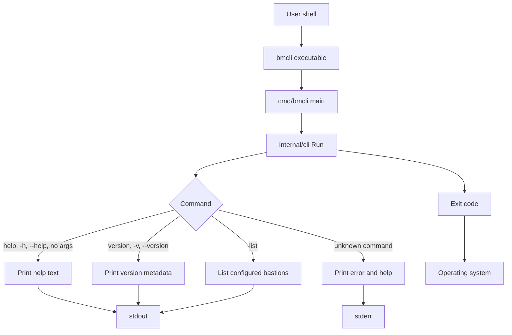

# bmcli architecture

`bmcli` is currently a compact Go command line application with a thin
executable entrypoint and a reusable internal CLI package.

## Components

- `cmd/bmcli/main.go` is the process entrypoint. It passes command line
  arguments and process streams into the CLI package, then exits with the code
  returned by the command runner.
- `internal/cli` owns command dispatch, config loading for local bastion
  inventory, help output, version output, list output, error messages, and exit
  code selection.
- Build metadata is injected into `internal/cli.Version`,
  `internal/cli.Commit`, and `internal/cli.Date` with Go linker flags during
  release builds.

## Command flow

1. The user runs `bmcli` from a shell.
2. `main` calls `cli.Run(os.Args[1:], os.Stdout, os.Stderr)`.
3. `cli.Run` dispatches the requested command.
4. Recognized commands write results to `stdout` and return exit code `0`.
5. `list` reads the configured bastion JSON file, maps records to safe summary
   fields, and treats a missing default config or empty inventory as a successful
   empty result with a setup suggestion.
6. Unknown commands write an error plus help text to `stderr` and return exit
   code `1`.
